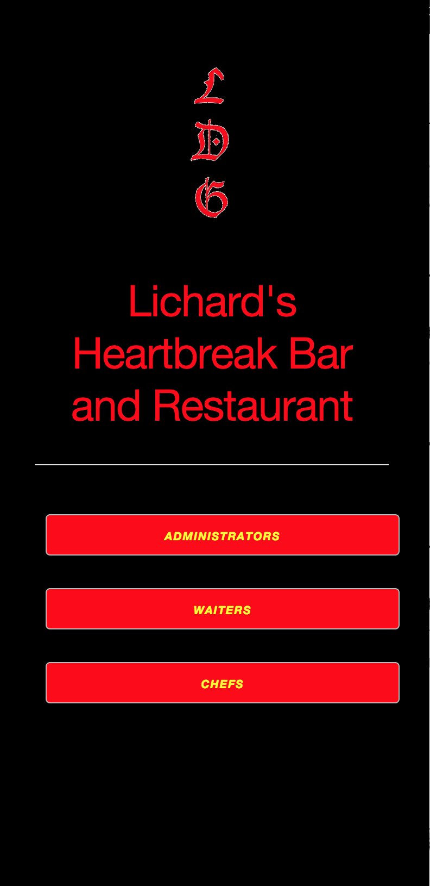
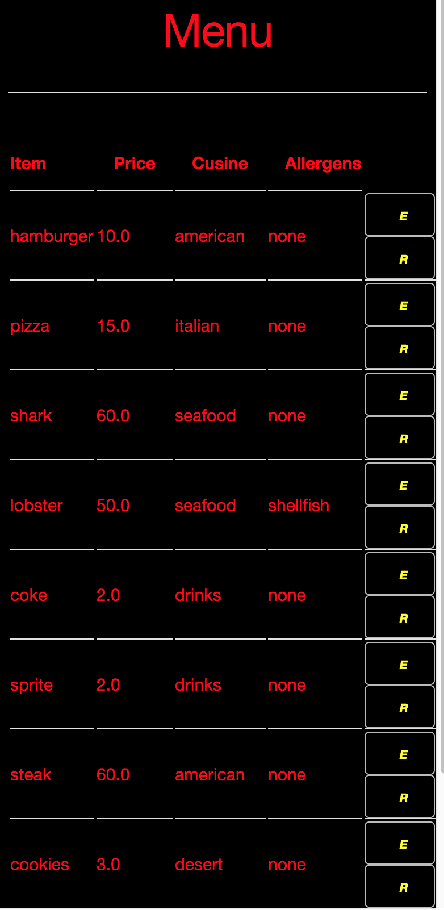
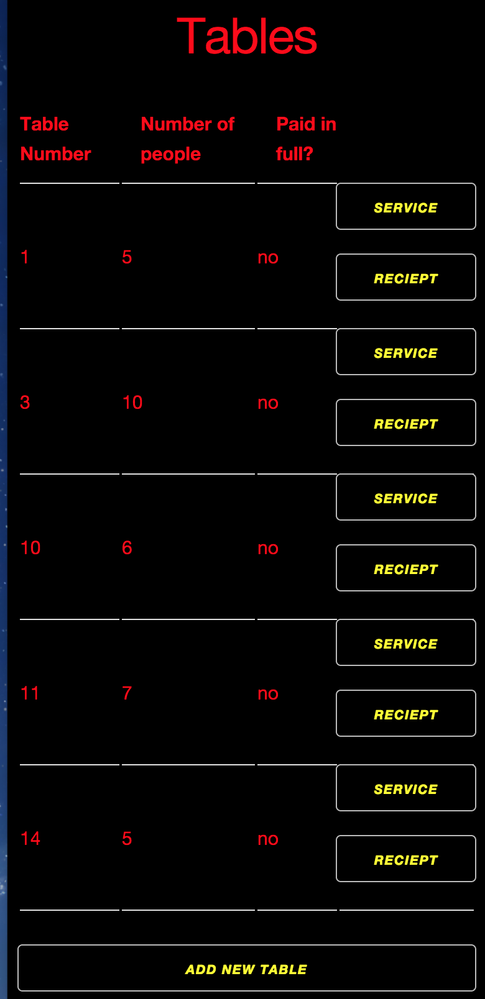
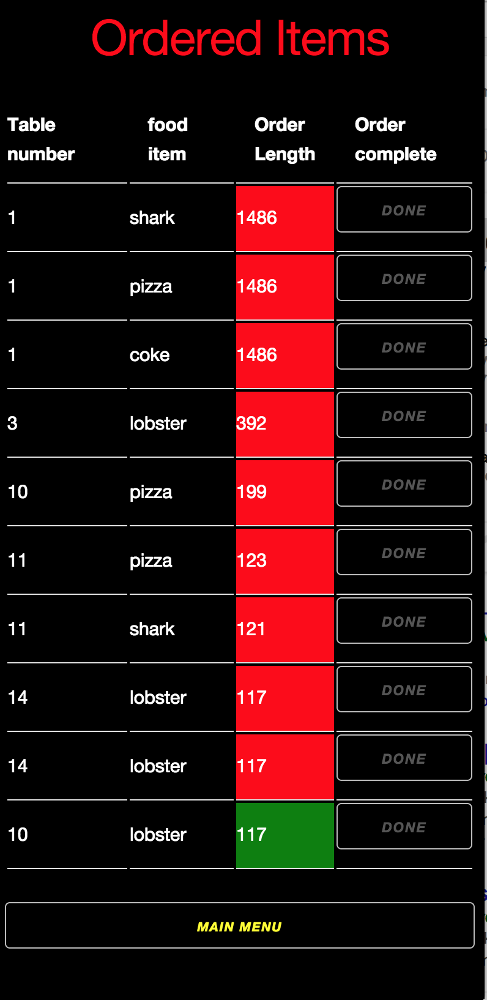

##Restaurant Application

###App Objectives
- The App is meant to serve the needs of the management, servers, and chefs of Lichard's HeartBreak Bar and Restaurant.

###Using the App
- Main menu is the portal to the rest of the application

- The menu screen can be access by pushing the Administrator. The menu screen allows the Administrator to add edit(e) and remove(r) food items form the menu.  

- Waiters can manage tables through the Table management interface. Here waiters can add tables service existing tables and print out customer receipts.

-Chefs can manage the outstanding orders through the order management interface

##Technologies
- **HTML**
- **Ruby**
- **CSS**
- **JavaScript**
- **jQuery**

##UserStory
- As a user I would like to add, edit, and remove food items so that I can mange the restaurants menu.

- As a user I would like add tables to the app so that I can service new customers.

- As a user I would like to add new orders to the App so that I can keep track of customer orders.

- As a user I would like generate a receipt so that I can keep customers uptodate on how much they have spent.

- As a user I would like to know when orders came into the kitchen and how long before they are made so that I can prioritize which dishes need to be made.
